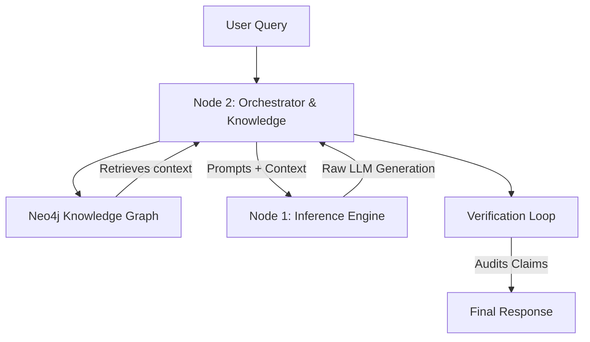
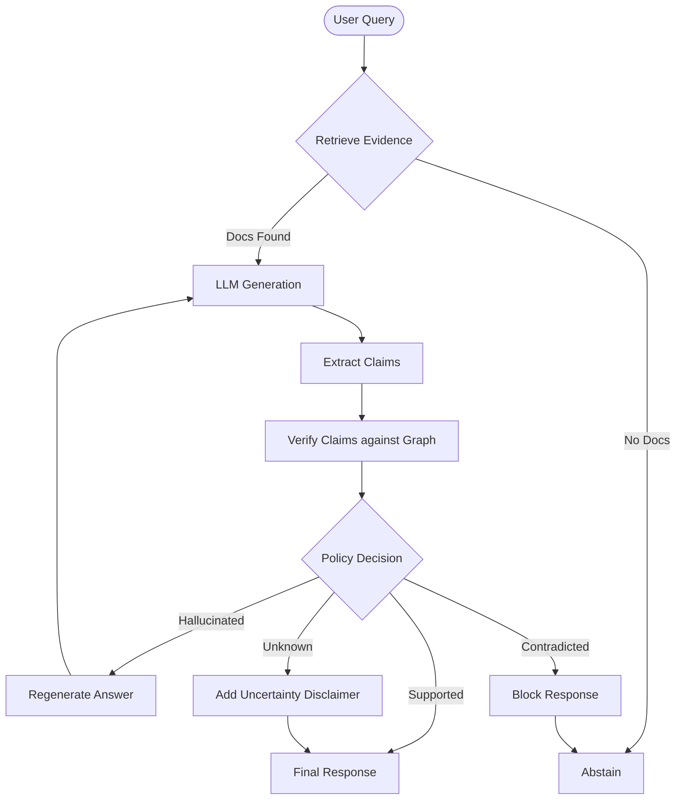

# 🧠 Local Knowledge Engine (Enterprise GraphRAG)

> **A Privacy-First, Hallucination-Resistant RAG System for High-Stakes Domains.**

---

## 📸 Demo

> *[Insert GIF: User asks "Is my flooded home covered?", System retrieves policy, finds exclusion clause, and correctly answers "No, due to unoccupancy".]*

---

## 🛑 The Problem: Why Standard RAG Fails

In high-stakes domains like **Insurance** or **Banking**, "almost correct" is dangerous.
Standard RAG (Vector Search) treats documents as "bags of words." It excels at similarity but fails at **logic**.

**The "Exception Clause" Failure Mode:**
1.  **Policy Page 5:** *"Coverage provided for all water damage."* (matches "flood" ✅)
2.  **Policy Page 96:** *"Exclusion: No coverage if unoccupied >30 days."* (semantically distant from "flood" ❌)

**Result:** A vector database retrieves Page 5, ignores Page 96, and the LLM confidently hallucinates a payout.

---

## 💡 The Solution: Graph-Augmented Generation (GraphRAG)

This engine moves beyond simple vectors to **Structured Reasoning**.
By treating the policy as a **Knowledge Graph**, we explicitly map the relationships between clauses.

*   `Policy` → *HAS_CLAUSE* → `Water Damage`
*   `Water Damage` → *MODIFIED_BY* → `Unoccupancy Exclusion`

When the system queries for "Water Damage", it **physically cannot ignore** the connected Exclusion node. The graph traversal enforces logical consistency that vectors miss.

---

## ⚙️ Architecture

The system uses a **Dual-Node Architecture** to balance performance and logic.

### Key Components

*   **Node 2 (Orchestrator)**: The brain. Handles retrieval, verification, and API hosting.
*   **Node 1 (Inference)**: The muscle. Purely runs the LLM (Ollama) and returns raw text.
*   **Knowledge Graph (Neo4j)**: Stores specific policy clauses and their relationships.
*   **Verification Loop**: A specialized agent that audits every generated sentence against the graph.

### 🧠 Reasoning Flow (LangGraph)

The system doesn't just "generate"; it follows a rigorous state machine to ensure correctness.

---

## 🏗️ Data Ingestion

Ingestion is the backbone of RAG. We don't just "dump" text; we structure it.

*   **PDF Parsing**: Uses `PyMuPDF` to extract clean text from complex layouts.
*   **Recursive Chunking**: Splits text while preserving semantic boundaries.
*   **Graph Construction**: Automatically identifies entities (`Policy`, `Exclusion`, `Limit`) and links them in Neo4j.

---

## 🧪 Testing & Evaluation

We treat prompts as code. Every change is tested.

*   **Unit Tests**: Standard `pytest` suite for API endpoints and graph query logic.
*   **RAG Evaluation**: (Planned) Using **DeepEval** to measure:
    *   *Faithfulness*: Does the answer come from the context?
    *   *Answer Relevancy*: Does it actually answer the user's question?

---

## 📊 Observability (LangSmith)

Determinism requires visibility. We use **LangSmith** to trace individual agent steps.
*   Debug why a specific node was retrieved.
*   Analyze token usage per query.
*   Visualize the "Chain of Thought" in the Verification Loop.

---

## 🚀 Key Features

*   ✅ **Hallucination Resistance**: verification loops reject unsupported claims.
*   ✅ **Deep Document Understanding**: Parses complex PDFs, linking disconnected clauses across hundreds of pages.
*   ✅ **Privacy-First Design**: Designed to run 100% locally. No data is sent to OpenAI/Anthropic.
*   ✅ **Self-Correction**: The system detects ambiguity and asks clarifying questions instead of guessing.

---

## 🛠️ Tech Stack

*   **Languages**: Python 3.11+
*   **Graph Database**: Neo4j (Cypher Query Language)
*   **Orchestration**: LangChain, LangGraph
*   **Inference**: Ollama (Local), support for Gemini/OpenAI (Hybrid)
*   **API**: FastAPI
*   **UI**: Alpine.js + TailwindCSS

---

## 📐 Design Patterns & Best Practices

This project isn't just a script; it's engineered with scalable software patterns:

*   **Factory Pattern**: [`LLMFactory`](./app/inference/factory.py) dynamically instantiates backend LLMs (Ollama/Gemini/OpenAI) based on configuration, allowing hot-swapping of models.
*   **Adapter Pattern**: [`Node1LLM`](./app/inference/llm_adapter.py) adapts the internal Node 1 HTTP API to the standard `LLMInterface`, allowing LangGraph to treat a remote microservice as a local object.
*   **Strategy Pattern**: The Retrieval Service switches between `VectorSearch`, `GraphTraversal`, and `HybridSearch` strategies based on query complexity.
*   **Event-Driven Architecture**: The Verification Loop operates as an asynchronous event pipeline, decoupling generation from validation.
*   **Repository Pattern**: Neo4j interactions are abstracted into a repository layer, isolating Cypher queries from business logic.

---

## 🔮 Future Roadmap

*   [ ] **Multi-Modal Ingestion**: Using Vision-Language Models (VLMs) to parse complex tables and handwriting in insurance forms.
*   [ ] **Edge Deployment**: Optimizing the graph engine to run on edge devices (search-on-laptop).
*   [ ] **Active Learning**: Allowing the verify agent to "flag" graph errors for human review.

---

> *Built by [Your Name]. Passionate about Engineering Safe, Deterministic AI Systems.*
